# Anti-Money-Laundering-using-Keras

This project is focused towards using deep learning library Keras and classifying every transaction as fraudulent(1) and non-fraudulent(0).

## Step by step

```python

'''importing the required libraries'''

import pandas as pd
import seaborn as sns
import matplotlib.pyplot as plt
import numpy as np
from imblearn.over_sampling import SMOTE
from sklearn.model_selection import train_test_split
from sklearn.metrics import classification_report
from sklearn.metrics import confusion_matrix
from sklearn.metrics import accuracy_score
from keras.models import Sequential
from keras.layers import Dense
from sklearn.metrics import accuracy_score
```

```python

'''Importing the dataset and checking its properties '''

df =  pd.read_csv("AML_dataset.csv")
df.head()
```
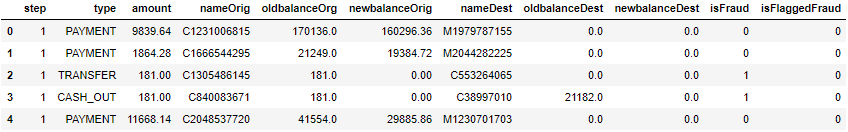

```python
df.info()
```
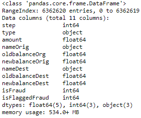

```python
df.describe()
```
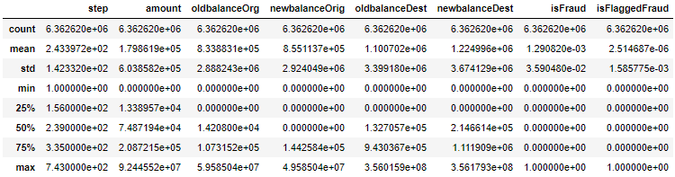

```python

'''removing the unwanted features / too many unique values'''

df.drop('nameOrig', axis=1, inplace=True)
df.drop('nameDest', axis=1, inplace=True)
df.drop('isFlaggedFraud', axis=1, inplace=True)

'''Checking for any null values'''

print('Null Values =',df.isnull().values.any())
```
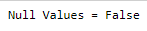

```python

''' Visualising the variables by grouping them by class '''

df.groupby('isFraud').hist(figsize=(16, 20), bins=50, xlabelsize=8, ylabelsize=8,alpha=0.4)
```
### Non-Fraudulent(0)
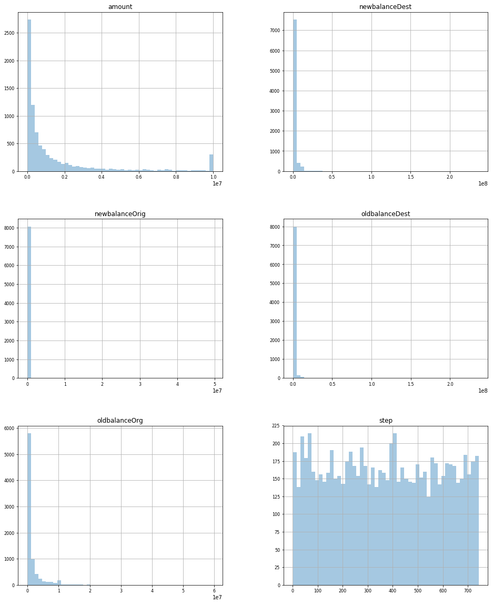

### Fraudulent(1)


```python

''' correlation matrix to check multicolinearity between variables '''

correlation = df.corr()
plt.figure(figsize=(15,15))
plt.title('Correlation Matrix')
sns.heatmap(correlation, vmax=1, square=True,annot=True,cmap='cubehelix')
```
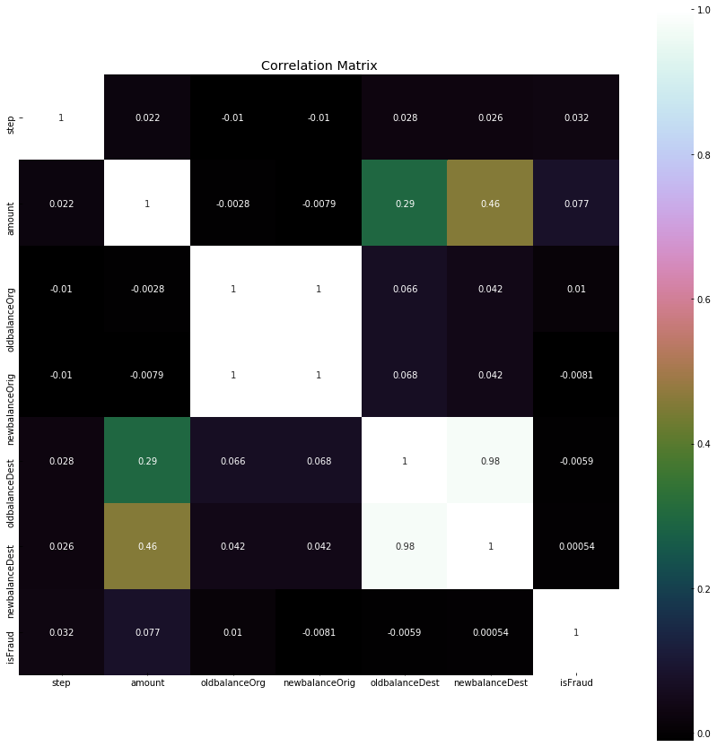

In the correlation matrix we can see that variable oldbalanceDest and newbalanceDest are highly correlated to each other, hence will remove one of the variables.

```python

''' creating dummy variables for categorical values '''

dum = pd.get_dummies(df['type'])
df1 = pd.concat([df,dum],axis=1)
df1.drop(['type'],axis=1, inplace=True)

'''checking if target class is balanced or not'''

df2 = df1.sample(n=20000)
df2.isFraud.value_counts().plot.bar()
print(df2.isFraud.value_counts())
```
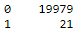
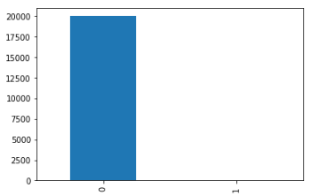

As the dataset is big and requires a lot of computation power, we will use only 20,000 randomly chosen transactions to train our model and evaluate the results.

```python

'''Splitting the data into training and test'''

X_train, X_test, y_train, y_test = train_test_split(df2.drop(['isFraud'],axis=1), df2['isFraud'], test_size=0.3, random_state=0)

print("Before OverSampling, counts of label '1': {}".format(sum(y_train==1)))
print("Before OverSampling, counts of label '0': {} \n".format(sum(y_train==0)))

'''resampling the training data'''

sm = SMOTE(random_state=10, ratio = 1.0)
x_train_res, y_train_res = sm.fit_sample(X_train, y_train)

print('After OverSampling, the shape of train_X: {}'.format(x_train_res.shape))
print('After OverSampling, the shape of train_y: {} \n'.format(y_train_res.shape))

print("After OverSampling, counts of label '1': {}".format(sum(y_train_res==1)))
print("After OverSampling, counts of label '0': {}".format(sum(y_train_res==0)))

```
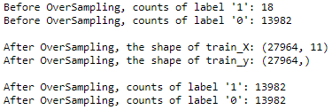

```python

''' Feature scaling '''

from sklearn.preprocessing import StandardScaler
sc = StandardScaler()
x_train_scaled = sc.fit_transform(x_train_res)
x_test_scaled = sc.transform(X_test)

''' Initializing the model '''

model = Sequential()

''' Adding the input layer and the first hidden layer '''

model.add(Dense(input_dim=11, output_dim = 6, init = 'uniform', activation = 'relu'))

''' Adding the second hidden layer '''

model.add(Dense(output_dim = 6, init = 'uniform', activation = 'relu'))

''' Adding the output layer '''

model.add(Dense(output_dim = 1, init = 'uniform', activation = 'sigmoid'))

''' Compiling and fitting the model '''

model.compile(optimizer = 'adam', loss = 'binary_crossentropy', metrics = ['accuracy'])
model_info = model.fit(x_train_scaled, y_train_res, batch_size = 10, nb_epoch = 10)

''' Plotting the training curves '''

def plot_model_history(model_history):
    fig, axs = plt.subplots(1,2,figsize=(15,5))
    # summarize history for accuracy
    axs[0].plot(range(1,len(model_history.history['acc'])+1),model_history.history['acc'])
    #axs[0].plot(range(1,len(model_history.history['val_acc'])+1),model_history.history['val_acc'])
    axs[0].set_title('Model Accuracy')
    axs[0].set_ylabel('Accuracy')
    axs[0].set_xlabel('Epoch')
    axs[0].set_xticks(np.arange(1,len(model_history.history['acc'])+1),len(model_history.history['acc'])/10)
    axs[0].legend(['train', 'val'], loc='best')
    # summarize history for loss
    axs[1].plot(range(1,len(model_history.history['loss'])+1),model_history.history['loss'])
    #axs[1].plot(range(1,len(model_history.history['val_loss'])+1),model_history.history['val_loss'])
    axs[1].set_title('Model Loss')
    axs[1].set_ylabel('Loss')
    axs[1].set_xlabel('Epoch')
    axs[1].set_xticks(np.arange(1,len(model_history.history['loss'])+1),len(model_history.history['loss'])/10)
    axs[1].legend(['train', 'val'], loc='best')
    plt.show()
plot_model_history(model_info)
```
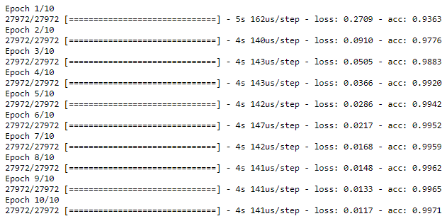
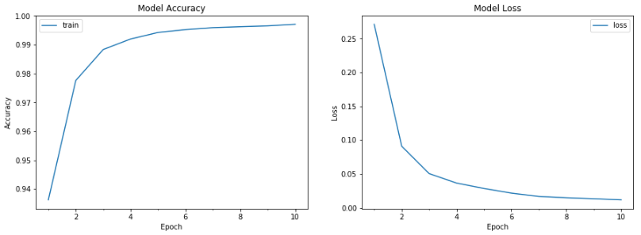

As the output of the model is binary (0 or 1), we have used relu and sigmoid as the activation functions. They are considered to be more effective to deal with binary classification problems. In the graphs it can be seen that the model is learning at every epoch and minimizing the loss. These graphs make it easier to choose the number of epochs as after a certain level the loss will start moving up again. It is also used to tackle over fitting while training the models. 

```python
''' Predicting the test results '''

y_pred = model.predict_classes(x_test_scaled)
acc = accuracy_score(y_test,y_pred)*100
print('Accuracy:',round(acc,2))
```
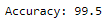

```python

''' Generating the Confusion matrix and Classification report'''

print('Confusion matrix', '\n', confusion_matrix(y_test, y_pred), '\n')
print('Classification report', '\n', classification_report(y_test, y_pred), '\n')
```
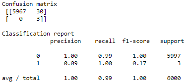


## About Used Dataset 
This is a Synthetic Financial Datasets For Fraud Detection. There are 6362620 rows.

Link : https://www.kaggle.com/ntnu-testimon/paysim1

-Features

1. step: Maps a unit of time in the real world. In this case 1 step is 1 hour of time.
2. type: CASH-IN, CASH-OUT, DEBIT, PAYMENT and TRANSFER
3. amount: amount of the transaction in local currency
4. nameOrig: customer who started the transaction
5. oldbalanceOrg: initial balance before the transaction
6. newbalanceOrig: customer's balance after the transaction.
7. nameDest: recipient ID of the transaction.
8. oldbalanceDest: initial recipient balance before the transaction.
9. newbalanceDest: recipient's balance after the transaction.
10. isFraud: identifies a fraudulent transaction (1) and non fraudulent (0)
11. isFlaggedFraud: flags illegal attempts to transfer more than 200.000 in a single transaction.
